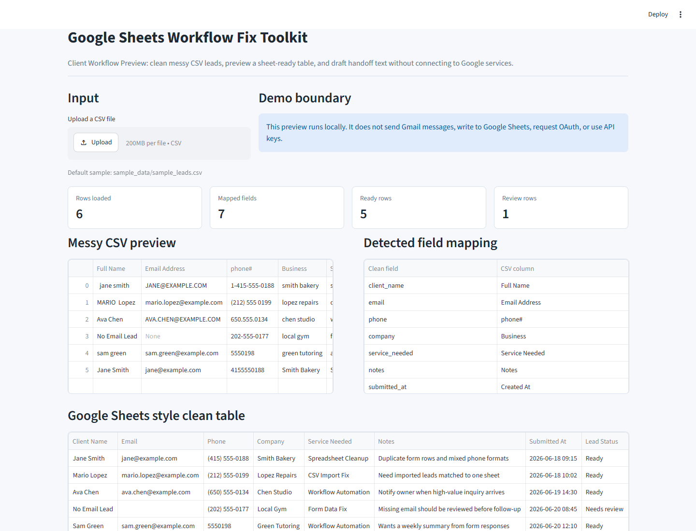

# Google Sheets Workflow Fix Toolkit

Client Workflow Preview demo for cleaning messy CSV or form data before it is copied into a Google Sheets workflow.

This project is a local-only showcase. It does not connect to Gmail, Google Sheets, Google OAuth, or any paid service.

## Who It Is For

- Small business owners who receive messy form exports
- Freelancers preparing client workflow previews
- Google Sheets users who need cleaner lead tables
- Teams that want a safe demo before real automation work

## Demo Flow

1. Load `sample_data/sample_leads.csv` or upload another CSV file.
2. Detect and map messy field names into a standard lead workflow table.
3. Clean names, emails, phone numbers, company names, service labels, and empty values.
4. Preview a Google Sheets style clean table.
5. Generate a Gmail notification preview without sending email.
6. Generate a client delivery note that explains mapping, review items, and safety limits.

## Local Run

Open PowerShell in the project folder:

```powershell
python -m venv .venv
.\.venv\Scripts\Activate.ps1
python -m pip install -r requirements.txt
streamlit run app.py
```

Then open:

```text
http://localhost:8501
```

## Sample Input

Sample data is included here:

```text
sample_data/sample_leads.csv
```

The file uses fake names, fake emails, fake phone numbers, and fake business notes.

## Screenshot



If the screenshot is missing, run the app first and then use:

```powershell
python -m pip install -r requirements-dev.txt
python tools/demo_capture/capture_web_demo.py
```

If Playwright reports a missing browser, run:

```powershell
python -m playwright install chromium
python tools/demo_capture/capture_web_demo.py
```

## Sensitive Information Check

Before pushing to GitHub, check that the repository does not include:

- API keys
- Tokens
- Cookies
- Passwords
- `.env`
- Real customer data
- Browser sessions
- Private databases
- Unredacted logs

This demo includes `.env.example` only. It does not require any secret.

## Current Limitations

- No real Gmail sending
- No real Google Sheets writing
- No Google OAuth
- No login system
- No payment system
- No multi-user backend
- No cloud deployment
- CSV preview only

## Project Structure

```text
app.py
requirements.txt
sample_data/
  sample_leads.csv
screenshots/
  workflow-preview.png
tools/
  demo_capture/
    capture_web_demo.py
    README.md
```

## Test

Basic Python syntax check:

```powershell
python -m compileall app.py
```

Optional import check:

```powershell
python -c "import pandas, streamlit; print('imports ok')"
```
